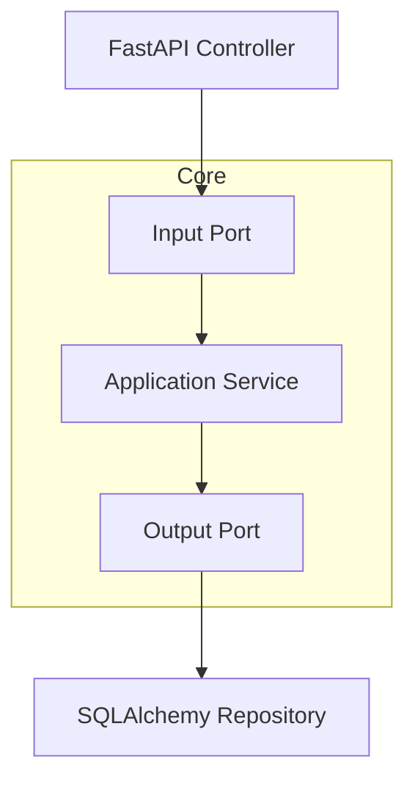

# 🔌 Adapters in Hexagonal Architecture

In Hexagonal Architecture, **adapters are the concrete implementations** of the ports we defined earlier.

Where **ports define *what* your application can do**, adapters define **how it actually does it** — whether it's through a web API, a database, or a CLI.

---

## ⚡ Two Types of Adapters

| Adapter Type         | Also Called     | Responsibility                                     |
|----------------------|-----------------|----------------------------------------------------|
| **Primary Adapter**  | Driving Adapter | *Calls into* the application via input ports (e.g., HTTP handler) |
| **Secondary Adapter**| Driven Adapter  | *Is called by* the application via output ports (e.g., DB repository) |

---

## 🧭 Primary Adapter — Example with FastAPI

A **primary adapter** typically handles requests and forwards them to the application core.

Let’s say you want to expose a `/pets` API endpoint using FastAPI:

```python
# adapters/primary/pet_api.py
from fastapi import APIRouter, Depends
from ports.input_ports import CreatePetPort
from domain.models import PetRequest

router = APIRouter()

@router.post("/pets")
def create_pet(
    request: PetRequest,
    use_case: CreatePetPort = Depends()
) -> Pet:
    return use_case.create_pet(name=request.name, age=request.age)
```

✅ Note how this code:

* **Depends on the input port**, not the service directly
* Contains **no core logic** — just request parsing and forwarding
* Leaves **testability and flexibility** intact

---

## 🗃️ Secondary Adapter — Example with SQLAlchemy

A **secondary adapter** implements an output port. For example, persisting pets to a database:

```python
# adapters/secondary/sqlalchemy_pet_repo.py
from ports.output_ports import PetRepositoryPort
from domain.models import Pet
from infrastructure.database import SessionLocal

class SqlAlchemyPetRepository(PetRepositoryPort):
    def save(self, pet: Pet) -> None:
        with SessionLocal() as session:
            session.add(pet)
            session.commit()
```

✅ Note how this code:

* Implements the output port
* Encapsulates persistence logic
* Can be swapped for in-memory, mock, or API-based versions

---

## 🧠 Recap: How Adapters Fit In



---

## 🧪 Bonus: Plugging in Adapters with Dependency Injection

In your FastAPI app, you'll typically wire up your adapters like this:

```python
# main.py
from fastapi import FastAPI
from adapters.primary.pet_api import router
from adapters.secondary.sqlalchemy_pet_repo import SqlAlchemyPetRepository
from application.create_pet import CreatePetService

app = FastAPI()

pet_repo = SqlAlchemyPetRepository()
create_pet_use_case = CreatePetService(repo=pet_repo)

# FastAPI dependency override
def get_create_pet_use_case():
    return create_pet_use_case

app.include_router(router, dependencies=[Depends(get_create_pet_use_case)])
```

This keeps **control of instantiation outside the core logic**, honoring the hexagonal boundary.

---

## 🧩 Summary

* **Adapters** implement the ports you defined earlier
* **Primary adapters** call into your app (e.g., FastAPI, CLI)
* **Secondary adapters** are used by your app (e.g., DB repo, API client)
* You can swap adapters without changing your core logic
* Everything remains **decoupled, testable, and clean**

➡️ [Next: `03_application_core.md`](./03_application_core.md)

