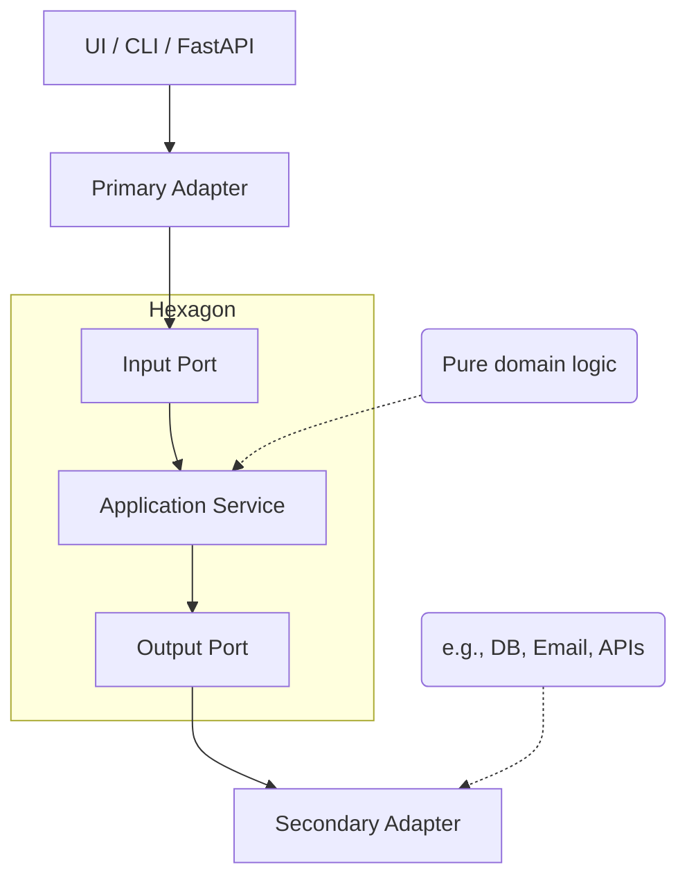

# Hexagonal Architecture (Ports & Adapters) in Python

Hexagonal Architecture — also known as the **Ports and Adapters** pattern — is a way of structuring software that makes your **core application logic** independent from frameworks, databases, and external tools.

This means your app becomes more **testable**, **adaptable**, and **clean**.

---

## 🌟 Why Use Hexagonal Architecture?

Traditional applications often follow a layered architecture where frameworks like FastAPI, ORMs, and other dependencies leak into the core business logic. Over time, this leads to:

- 💔 Tight coupling to frameworks  
- 😵 Hard-to-test domain logic  
- 🚫 Fragile and hard-to-maintain code  

Hexagonal architecture solves this by **inverting dependencies** and organizing your code around **use cases**, not technologies.

---

## 🧠 Core Ideas

| Concept               | Role                                                      |
|-----------------------|-----------------------------------------------------------|
| **Ports**             | Abstract interfaces that define how your app communicates |
| **Adapters**          | Concrete implementations of those ports                   |
| **Application Core**  | Business logic — clean, decoupled, testable               |

---

## 🔌 A Visual Overview

---

## 🧩 Structure of This Guide

This documentation will walk you through each part step-by-step:

| File                                                             | Description                                             |
| ---------------------------------------------------------------- | ------------------------------------------------------- |
| [`01_ports.md`](./01_ports.md)                                    | What are ports? Input vs output, and why they matter    |
| [`02_adapters.md`](./02_adapters.md)                              | Understanding adapters (primary vs secondary) with code |
| [`03_application_core.md`](./03_application_core.md)             | How to structure your clean, decoupled core             |
| [`04_integrating_frameworks.md`](./04_integrating_frameworks.md) | How to plug in FastAPI, ORMs, and services              |

---

## 🚀 Goals

* Teach **Hexagonal Architecture** in an accessible, Pythonic way
* Use **FastAPI**, **clean code**, and **best practices**
* Provide **simple examples** and real-world use cases
* Help you write **flexible and testable** applications

---

## 🛠️ Technologies Used

* Python 3.11+
* FastAPI
* SQLAlchemy (optional for examples)
* Pydantic
* Python typing & protocols

---

## 🔍 Who Is This For?

This guide is perfect if you:

* Understand basic Python and FastAPI
* Want to make your codebase cleaner and easier to maintain
* Are curious about software architecture principles
